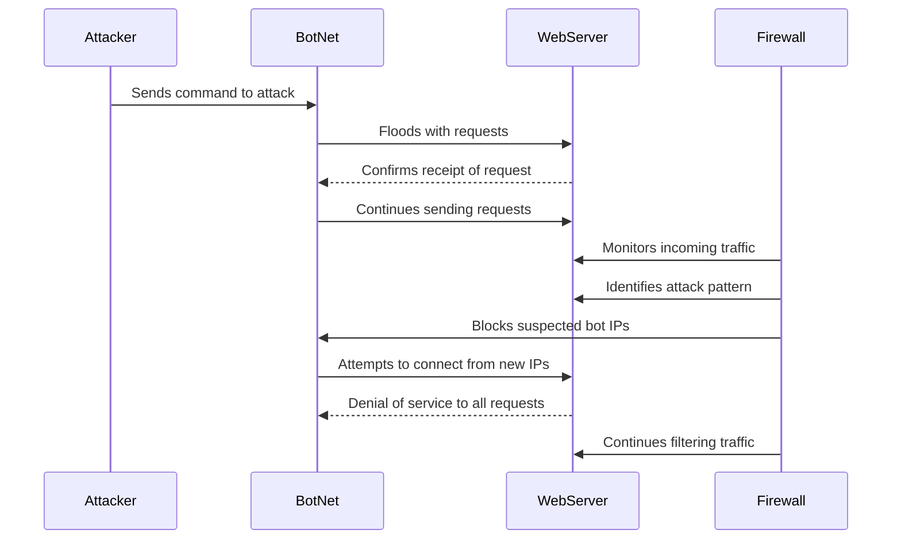

## DDoS Attack Sequence Diagram

1. **Attacker to BotNet:** The attacker gives a command to the BotNet to start the DDoS attack on the target, which is the web server

2. **BotNet to WebServer:** The bots in the botnet overwhelm the web server with too many requests

3. **WebServer to BotNet:** When the requests reach the web server, it confirms they have been received but quickly gets overloaded by the high number of requests

4. **BotNet to WebServer:** The bots keep sending requests nonstop, making the situation worse for the web server

5. **Firewall to WebServer:** The firewall starts watching the incoming traffic to the web server, looking for signs of a sudden spike in requests that indicates a DDoS attack

6. **Firewall to WebServer:** After noticing the unusual traffic pattern, the firewall evaluates the incoming connections and begins to take protective actions.
   
7. **Firewall to BotNet:** The firewall responds by cutting off the bots access to the web server

8. **BotNet to WebServer:** The bots try to connect to the web server again using new IP addresses in an attempt to get around the firewall's blocks

9. **WebServer to BotNet:** However, the server knows there is still an attack happening, so it denies service to all incoming requests

10. **Firewall to WebServer:** The firewall keeps filtering incoming traffic in real-time, analyzing patterns, and strengthening its defenses against more attempts from the botnet
