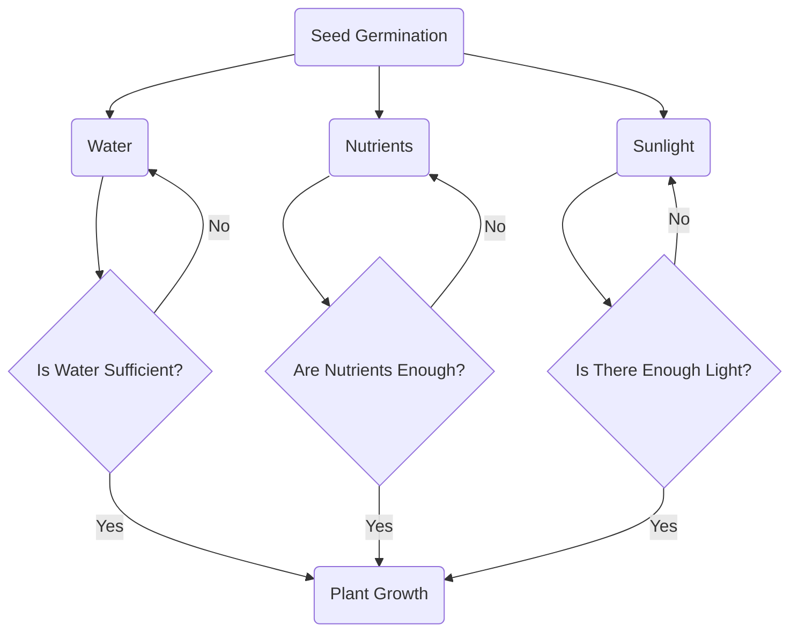

## Choose My Own Adventure Diagram

1. **Seed Germination:** The starting point for plant growth, where seeds begin to sprout

2. **Water:** One of the key requirements for plant growth

3. **Nutrients:** Essential minerals and compounds the plant needs for development

4. **Sunlight:** Necessary for photosynthesis

5. **Is Water Sufficient?:** A check to see if the plant is getting enough water, if not, indicate the need to water more

6. **Are Nutrients Enough?:** A check to see if the plant is getting enough nutrients, if not, indicate the need to feed the plant more nutrients

7. **Is There Enough Light?:** A check to see if the plant is getting enough light, if not, indicate the need to provide more light to the plant

8. **Plant Growth:** The plant has all necessary conditions met and can grow healthily 
