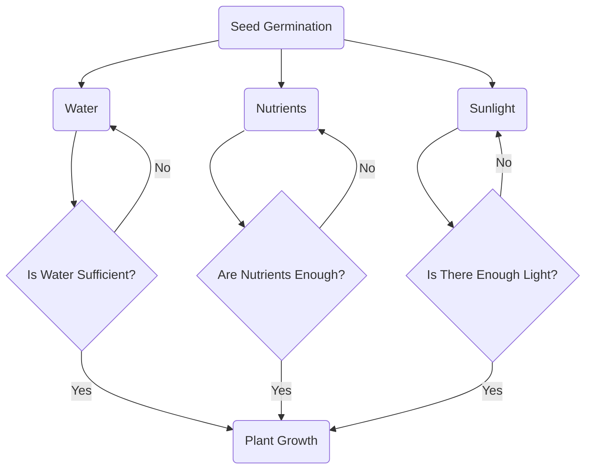

```mermaid
flowchart TD
    Start(Seed Germination) --> Water(Water)
    Start --> Fert(Nutrients)
    Start --> Sun(Sunlight)
    Water --> Dry{Is Water Sufficient?}
    Dry -- Yes --> Grow(Plant Growth)
    Dry -- No --> Water
    Fert --> Fed{Are Nutrients Enough?}
    Fed -- Yes --> Grow
    Fed -- No --> Fert
    Sun --> Dim{Is There Enough Light?}
    Dim -- Yes --> Grow
    Dim -- No --> Sun
```
