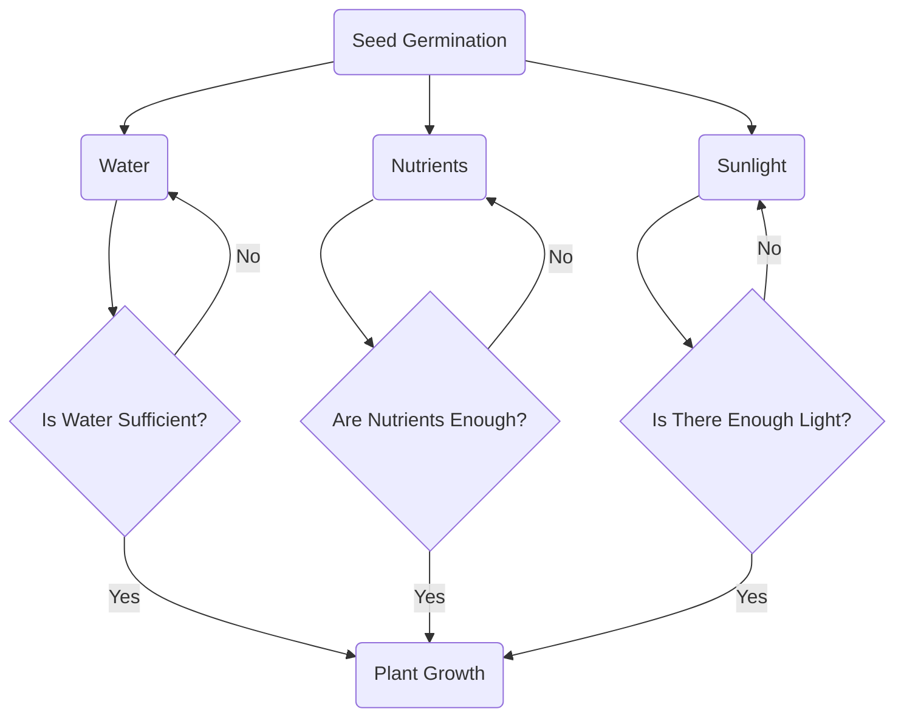

## Choose my own adventure diagram

**Seed Germination:** The starting point for plant growth, where seeds begin to sprout

**Water:** One of the key requirements for plant growth

**Nutrients:** Essential minerals and compounds the plant needs for development

**Sunlight:** Necessary for photosynthesis

**Is Water Sufficient?:** A check to see if the plant is getting enough water, if not, indicate the need to water more

**Are Nutrients Enough?:** A check to see if the plant is getting enough nutrients, if not, indicate the need to feed the plant more nutrients

**Plant Growth:** The plant has all necessary conditions met and can grow healthily 
