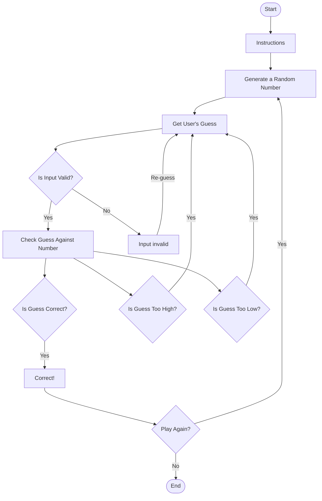

# Random Guessing Game

1. **Start**: Marks the beginning of the game.
2. **Generate Random Number**: The program generates a random number within a predefined range (e.g. 1 - 100)
3. **Instructions**: The game displays instructions to the user on how to play (e.g. "Guess a number between 1 and 100")
4. **Get User's Guess**: The program prompts the user to enter their guess
5. **Is Input Valid?**: The program checks whether the user's input is valid (numeric and within range)
   - **If Yes**: Proceed to check the user's guess against the generated number
   - **If No**: Display an error message and prompt the user to guess again
6. **Check Guess Against Number**: The program checks the user's guess to see if it matches the generated random number
7. **Is Guess Correct?**: The program evaluates whether the user's guess is correct
   - **If Yes**: Display a success message congratulating the user
   - **If No**: Proceed to check if the guess was too high or too low
8. **Is Guess Too High?**: Check if the guess was greater than the generated number
   - **If Yes**: Indicate that the guess is too high and prompt the user to guess again
9. **Is Guess Too Low?**: Check if the guess was lower than the generated number
   - **If Yes**: Indicate that the guess is too low and prompt the user to guess again
10. **Play Again?**: Asks the user if they want to play again after getting the guess correct
    - **If Yes**: Restart the game by generating a new random number
    - **If No**: End the game
   
    - Hopefully this is correct and according to the instructions, please allow me to resubmit, if not!
