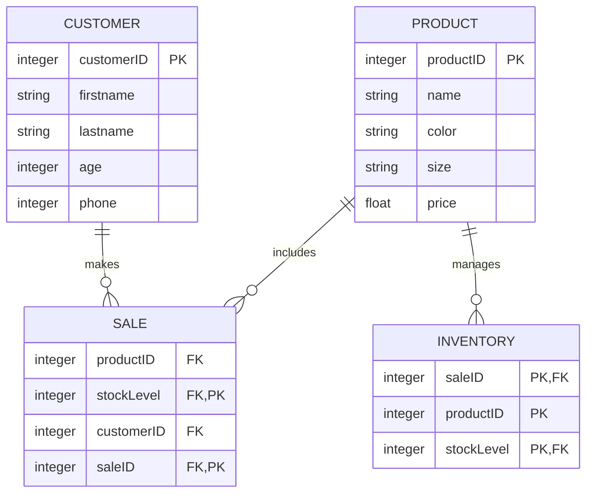

## Nike Shoe Store Entity-Relationship Diagram

## ERD Description
1. **PRODUCT** - Tracks Nike shoe models, their categories, and prices

2. **CUSTOMER** - Tracks customer IDs, their names, their age group, and their phone number

3. **SALE** - Tracks Nike shoe model sales, the stock level, which customer made a purchase, and a sale identifier for the inventory
   
4. **INVENTORY** - Tracks the sale identifier for profit, tracks the item(s) sold, and tracks the stock level
  

### Relationships
1. **PRODUCT to INVENTORY**: Products can be stored in many different inventory locations
2. **CUSTOMER to SALE**: A customer can make purchases
3. **PRODUCT to SALE**: A sale can include multiple different products
